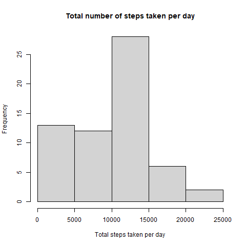
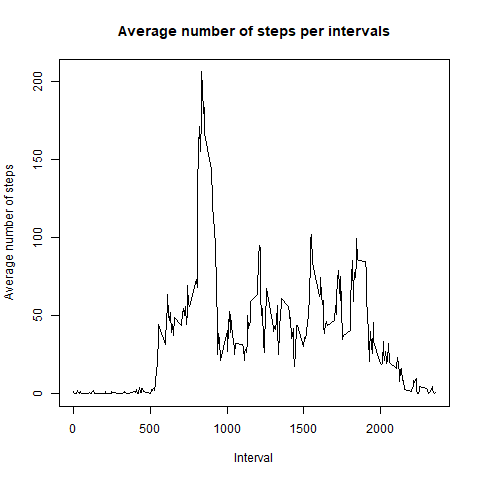
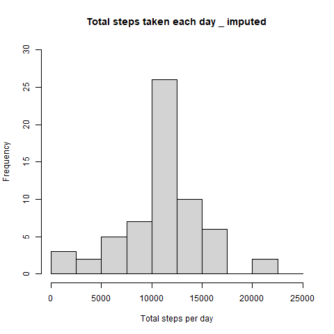
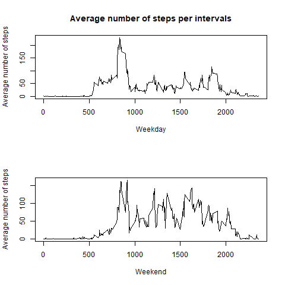

## Loading and preprocessing the data


```activity
library(readr)
activity <- read_csv("activity.csv")
```

## What is mean total number of steps taken per day?


```step_sum
step_sum <- with(activity,aggregate(steps, by = list(date), FUN = sum, na.rm=TRUE))
colnames(step_sum)<- c("date","steps")
hist(step_sum$steps,main = "Total number of steps taken per day", xlab = "Total steps taken per day")
```


Calculate mean and median 

```mean
mean <- mean(step_sum$steps)
median <- median(step_sum$steps)
```
```{echo=TRUE}
## [1] 9354.23
## [1] 10766.19
```

### What is the average daily activity pattern?


```step_med
step_med <- with(activity,aggregate(steps, by = list(interval), FUN = mean, na.rm=TRUE))
colnames(step_med)<- c("interval","steps")
plot(step_med$interval, step_med$steps, type = "l", xlab="Interval", ylab="Average number of steps", main="Average number of steps per intervals")
```



Which 5-minute interval, on average across all the days in the dataset, contains the maximum number of steps?

```st
# table for dplyr
library(dplyr)
ST <- tbl_df(step_med)
# find the column
ST %>% filter(steps==max(ST$steps))
```
```{echo=TRUE}
## [1] 835
```

### Imputing missing values

Calculate and report the total number of missing values in the dataset

```missing
sum(is.na(activity$steps)) 
```
```{echo=TRUE}
##[1] 2304
```

Devise a strategy for filling in all of the missing values in the dataset

```mean
imputed_step <- step_med$steps[match(activity$interval, step_med$interval)]
```

Create a new dataset that is equal to the original dataset

```activity_imputed
activity_imputed <- transform(activity, steps = ifelse(is.na(activity$steps), yes = imputed_step, no = activity$steps))
```

Make a histogram of the total number of steps taken each day and Calculate and report the mean and median total number of steps taken per day.

```plot
hist(step_sum$steps,xlab = "Total steps per day", ylim = c(0,30), main = "Total steps taken each day _ imputed", breaks = seq(0,25000,by=2500))
```


Calculate mean and median. We see that replacing missing data can make mean and median values become the same

```mean
mean <- mean(step_sum$steps)
median <- median(step_sum$steps)
```
```{echo=TRUE}
## [1] 10766.19
## [1] 10766.19
```

### Are there differences in activity patterns between weekdays and weekends?

Create a new factor variable in the dataset with two levels -- "weekday" and "weekend"

  - Create a function which separate weekday and weekend

```week
week <- function(x) {
  if (weekdays(x) == "Saturday" | weekdays(x) =="Sunday") 
  {y <- "Weekend"} else 
  {y <- "Weekday"}
  y
}
```
  
  - Re-format date data and create a new variables 

```activity_imputed
activity_imputed$date <- as.Date(strptime(activity_imputed$date, format="%Y-%m-%d"))
activity_imputed$week <- sapply(activity_imputed$date,week)
}
```

Make a panel plot containing a time series plot (i.e. type = “l”) of the 5-minute interval (x-axis) and the average number of steps taken, averaged across all weekday days or weekend days (y-axis).


```plot
activity_weekday <- activity_imputed %>% filter(week=="Weekday")
activity_weekend <- activity_imputed %>% filter(week=="Weekend")
step_week <- with(activity_weekday,aggregate(steps, by = list(interval), FUN = mean, na.rm=TRUE))
step_weekend <- with(activity_weekend,aggregate(steps, by = list(interval), FUN = mean, na.rm=TRUE))
week <- merge(step_week,step_weekend,by="Group.1")
colnames(week) <- c("interval","weekday","weekend")

   # Draw plots
par(mfrow = c(2, 1))
plot(week$interval, week$weekday, type = "l", ylab="Average number of steps", xlab = "Weekday", main="Average number of steps per intervals")
plot(week$interval, week$weekend, type = "l", xlab = "Weekend", ylab="Average number of steps")
```


   
